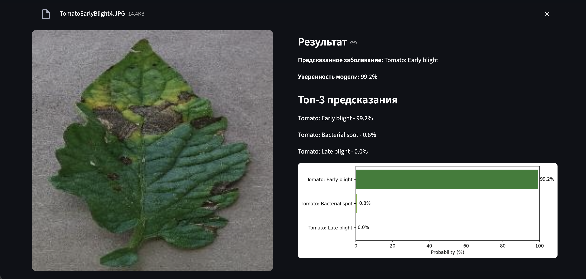

# Plant Disease Classifier

Классификатор болезней растений на PyTorch с использованием transfer learning.

Модель обучена на изображениях листьев растений и предсказывает заболевание (или его отсутствие) по фотографии.  
В качестве финальной модели используется `ResNet18` с fine-tuning последних слоёв (`layer4` и `fc`).

Проект реализует полный ML pipeline:

- обучение модели;
- сохранение артефактов в `artifacts/`;
- FastAPI-сервис для инференса;
- Streamlit-интерфейс для загрузки изображения и просмотра top-3 предсказаний.

## Features

- Классификация изображений (38 классов)
- Top-3 предсказания с вероятностями
- FastAPI API для инференса
- Streamlit UI для удобного взаимодействия
- Поддержка Docker

## Models

- **Baseline (эксперименты):** кастомная CNN  
- **Финальная модель:** ResNet18 с fine-tuning (`layer4 + fc`)

## Metrics

- **Validation Accuracy:** 99.3%
- **Macro F1-score:** ~0.99

Модель показывает высокое качество благодаря использованию предобученной ResNet и дообучению последних слоёв под задачу классификации заболеваний растений.

## Интерфейс



## Данные

Для обучения используется датасет с Kaggle:

[New Plant Diseases Dataset](https://www.kaggle.com/datasets/vipoooool/new-plant-diseases-dataset)

- Количество классов: 38  
- Задача: многоклассовая классификация изображений листьев растений  

После скачивания используйте директории `train` и `valid` из датасета и передайте их через переменные окружения:

```bash
export TRAIN_PATH="/полный/путь/к/train"
export VALID_PATH="/полный/путь/к/valid"
```

## Готовая модель

Если вы не хотите обучать модель локально, можно использовать уже готовые артефакты:

- `artifacts/best_model.pth`
- `artifacts/idx_to_class.json`

Если эти файлы уже лежат в папке `artifacts/`, сервис и интерфейс можно запускать сразу без шага обучения.

## Project Structure

```text
app/            # FastAPI API и Streamlit UI
src/            # обучение, инференс, оценка
artifacts/      # сохраненные модели и маппинг классов
notebooks/      # эксперименты
```

## Локальный запуск

### 1. Установка зависимостей

```bash
python3 -m venv .venv
source .venv/bin/activate
pip install -r requirements.txt
```

### 2. Обучение модели

```bash
python3 -m src.train
```

После обучения автоматически сохраняются:

- `artifacts/best_model.pth`
- `artifacts/idx_to_class.json`

После этого можно:

- использовать только что обученную модель;
- или положить в `artifacts/` уже готовую модель, полученную заранее.

## Docker

### Запуск через Docker Compose

Если в `artifacts/` уже лежат:

- `best_model.pth`
- `idx_to_class.json`

то можно сразу поднять сервис и интерфейс через Docker:

```bash
docker compose up --build
```

После запуска:

- API: `http://127.0.0.1:8000`
- Streamlit UI: `http://127.0.0.1:8501`

### Отдельный запуск только API

```bash
docker build -t plant-disease-classifier .
docker run --rm -p 8000:8000 plant-disease-classifier
```

## Ручной запуск без Docker

### 3. Запуск API

```bash
uvicorn app.api:app --reload
```

Проверка:

- `GET http://127.0.0.1:8000/health`
- `POST http://127.0.0.1:8000/predict`

Пример запроса:

```bash
curl -X POST "http://127.0.0.1:8000/predict" \
  -F "file=@/полный/путь/к/image.jpg"
```

## Example Response

```json
{
  "predicted_class": "Tomato___Late_blight",
  "confidence": 0.91,
  "top_3": [
    {"class_name": "Tomato___Late_blight", "probability": 0.91},
    {"class_name": "Tomato___Septoria_leaf_spot", "probability": 0.06},
    {"class_name": "Tomato___healthy", "probability": 0.02}
  ]
}
```

## 4. Запуск Streamlit UI

```bash
streamlit run app/streamlit_app.py
```

Интерфейс будет доступен по адресу:

- `http://127.0.0.1:8501`

## Основные команды

Обучение:

```bash
python3 -m src.train
```

Оценка:

```bash
python3 -m src.evaluate
```

Предсказание из CLI:

```bash
python3 -m src.predict --image /path/to/image.jpg
```
